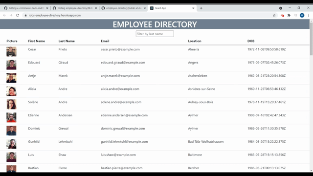

 
# Employee Directory

## Description

React app that lets a user sort a table of employees by various categories, or filter by text. This project was a good introduction to component state and passing event listeners down to children components via props.

[Check out the deployed application!](https://robs-employee-directory.herokuapp.com/)

## Table of Contents

- [Contributing](#Contributing)
- [Questions](#Questions)
- [License](#License)

## Questions

Questions? Reach out to me:

GitHub: [comatosino](https://github.com/comatosino)

Email: adamsiii.robert@gmail.com

## License
    
This project is covered under the [MIT](https://opensource.org/licenses/MIT) license.
